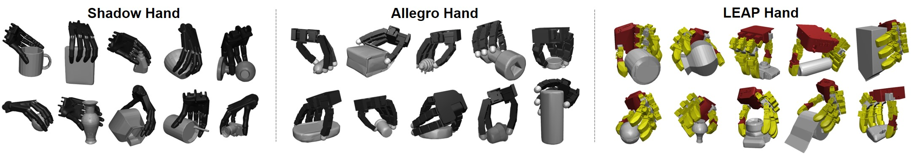
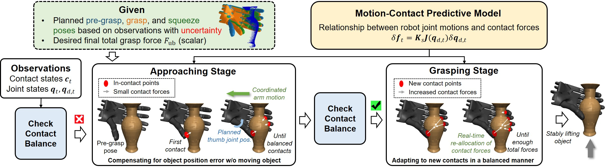

# Coordinated Contact Control for Adaptive Dexterous Grasping Under Uncertainty

[[Project Website](https://ada-grasp-ctrl.github.io/)]

<div align="center">
  
</div>

<div align="center">
  
</div>


## Getting Started

### Installation
1. Clone this repo.
1. Clone the third-party library [MuJoCo Menagerie](https://github.com/google-deepmind/mujoco_menagerie).
  ```
  git submodule update --init --recursive --progress
  ```
2. Third party:
  ```bash
  cd third_party
  # pytorch_kinematics
  git clone git@github.com:DexGrasp-TH/pytorch_kinematics.git
  cd pytorch_kinematics
  git checkout v1.0.0
  pip install -e .

  # mr_utils
  cd third_party
  git clone git@github.com:Mingrui-Yu/utils_python.git
  cd utils_python
  pip install -e .
  ```
3. Install the python environment via [Anaconda](https://www.anaconda.com/). 
  ```bash
  conda create -n DGBench python=3.10 
  conda activate DGBench
  pip install numpy==1.26.4
  conda install pytorch==2.2.2 pytorch-cuda=12.1 -c pytorch -c nvidia 
  pip install mujoco==3.3.2
  pip install trimesh
  pip install hydra-core
  pip install transforms3d
  pip install matplotlib
  pip install scikit-learn
  pip install usd-core
  pip install imageio
  pip install 'qpsolvers[clarabel]'
  pip install tqdm
  conda install pinocchio -c conda-forge
  ```

### Object Preparation
For the object assets used in [BODex](https://pku-epic.github.io/BODex/), please download the pre-processed object assets `DGN_2k_processed.zip` from [here](https://huggingface.co/datasets/JiayiChenPKU/BODex) and organize the unzipped folders as below. 
```
assets/object/DGN_2k
|- processed_data
|  |- core_bottle_1a7ba1f4c892e2da30711cdbdbc73924
|  |_ ...
|- scene_cfg
|  |- core_bottle_1a7ba1f4c892e2da30711cdbdbc73924
|  |_ ...
|- valid_split
|  |- all.json
|  |_ ...
```

## Usage

### Complete pipeline
1. Use [BODex](https://github.com/JYChen18/BODex) to synthesize tabletop grasp poses.
1. Use [DexLearn](https://github.com/JYChen18/DexLearn) to train a generative network.
1. Use DexLearn to sample grasp poses from single-view point clouds.
1. Use this repo to evaluate the grasping execution methods.

### Architecture
* The core fucntions of the grasp controller are at `src/util/grasp_controller.py`.
* The code of our method and baselines are at `src/task/control_eval_func/`.
* The core code related to mujoco simualtion is at `src/util/hand_util.py`.

### Evaluation of the grasping execution methods

The complete procedures for evaluation include the following steps:

#### format: convert the data format

Sample evaluation dataset from the generated grasp poses.

```bash
python src/main.py setting=tabletop hand=shadow task=format exp_name=learn task.data_name=Learning task.max_num=100 task.data_path=<PATH_TO_GENERATED_GRASPS>
```
Args:
* max_num: the amount of sampled grasps for evaluation. 
* data_path: path to generated grasps. e.g., `../DexLearn/output/bodex_tabletop_allegro_nflow_debug/tests/step_050000`

We provide pre-sampled 100 grasps of each hand in `output/learn_shadow`, `output/learn_allegro`, and `output/learn_leap_tac3d`. You can skip this step if you only want to use this example evaluation dataset.

#### dummy_arm_qpos: calculate the qpos of the dummy_arm via IK

We add a dummy arm to the hand to control the hand base in simulation, which consists of three prismatic joints and three revolute joints. Thus, we need to calculate the arm joint positions corresponding to the generated grasp poses via inverse kinematics.

```bash
python src/main.py setting=tabletop hand=shadow task=dummy_arm_qpos exp_name=learn task.max_num=-1
```

You may need to re-run it if the IK fails occasionally.

#### control_eval: evaluate the execution method and save the manipulation data

```bash
python src/main.py setting=tabletop hand=dummy_arm_shadow task=control_eval exp_name=learn task.method=ours task.input_data=grasp_dir task.debug_viewer=True
```
Args:
* task.method: (ours / op / bs1 / bs2 / bs3)
* task.offsets: the position perturbation distance ([0.00] / [0.02])
* task.debug_viewer: whether launch the mujoco viewer

#### control_stat: compute and save the statistic results.
```bash
python src/main.py setting=tabletop hand=dummy_arm_shadow task=control_stat exp_name=learn task.method=ours
```
Args:
* task.method: (ours / op / bs1 / bs2 / bs3)
* task.setting_name: (dist_0 / dist_2) corresponds to the position perturbation distance.

### Quick use

You can run the above commands using the following bash scripts:
```bash
# The `format` task is commented out by default
bash script/test_learning_dummy_arm_shadow.sh
bash script/test_learning_dummy_arm_allegro.sh
bash script/test_learning_dummy_arm_leap_tac3d.sh
```


After generating the qpos of dummy arms, the control_eval and control_stat under different conditions can be conveniently run via the following scripts:
```bash
python script/test_all_ablation_baseline_local.py # may need internal modification of the settings
```

### Quick visualizion of static grasps via trimesh
For a quick visualization of the generated grasp poses from DexLearn, you can use:
```bash
python script/quick_grasp_vis/vis_dexlearn_grasp.py # need internal modification of the grasp file path
```

## Notice

* While support for underactuated hands is theoretically available, the current code does not fully account for them. We are working on enabling this.

We are actively working on optimizing and refining the code until the paper is accepted. If you encounter any issues, please feel free to open an issue — your feedback helps us improve the project.


## Acknowledgement

This evaluation codebase is built upon [DexGraspBench](https://github.com/JYChen18/DexGraspBench)
 — many thanks to the authors for their great work.


