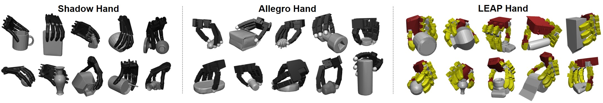
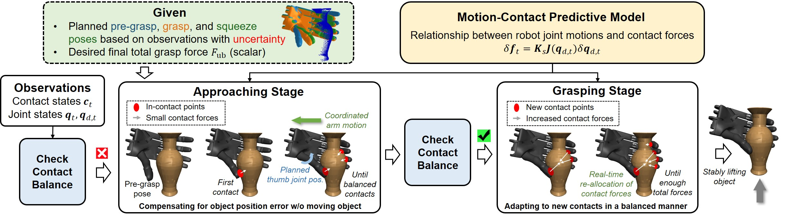

# Coordinated Contact Control for Adaptive Dexterous Grasping Under Uncertainty

[Project website](https://ada-grasp-ctrl.github.io/)

<div align="center">
  
</div>

<div align="center">
  
</div>

The maintained evaluation pipeline is:

```text
raw grasp -> format -> dummy_arm_qpos -> control_eval -> control_stat
```

Supported hands: Shadow, Allegro, and LEAP Tac3D. Supported controllers: `ours`, `op`, `bs1`, `bs2`, and
`bs3`. Supported input converters: BODex, Learning, and Batched.

## Installation

The maintained environment is Linux x86-64 with Python 3.10. Quick control simulation runs on CPU; the complete
pipeline uses an NVIDIA GPU compatible with CUDA 12.1 for the default `dummy_arm_qpos` configuration.

```bash
git clone --recurse-submodules https://github.com/ada-grasp-ctrl/ada-grasp-ctrl.git
cd ada-grasp-ctrl
conda env create -f environment.yml
conda activate ada-grasp-ctrl
python src/main.py --help
```

All application commands use `python src/main.py`; the package does not install an `ada-grasp-ctrl` console command.

For an existing clone, initialize the pinned dependencies before creating or updating the environment:

```bash
git submodule sync --recursive
git submodule update --init --recursive
```

## Quick start

The bundled quick and full examples use the minimal object asset included under `examples/assets/object/`. They do
not require the external DGN 2k object download described later.

Run the bundled Shadow example headlessly:

```bash
bash script/run_example.sh shadow quick
```

Quick mode uses a precomputed dummy-arm grasp and runs `control_eval -> control_stat`. The other supported hands use
the same command:

```bash
bash script/run_example.sh allegro quick
bash script/run_example.sh leap_tac3d quick
```

To watch the Shadow example in a browser:

```bash
bash script/run_example.sh shadow quick --viewer mjviser
```

Open the URL printed by mjviser. On a remote server, use the SSH forwarding command printed beside it.

To run all four stages from the bundled raw Learning fixture:

```bash
bash script/run_example.sh shadow full
```

Each example creates a new directory under `output/examples/<hand>/` and prints the final output path and result
summary.

## Object preparation for external BODex data

For the object assets used in [BODex](https://pku-epic.github.io/BODex/), download the pre-processed object assets
`DGN_2k_processed.zip` from the [BODex dataset](https://huggingface.co/datasets/JiayiChenPKU/BODex) and organize the
unzipped folders as follows:

```text
assets/object/DGN_2k
|- processed_data
|  |- core_bottle_1a7ba1f4c892e2da30711cdbdbc73924
|  |_ ...
|- scene_cfg
|  |- core_bottle_1a7ba1f4c892e2da30711cdbdbc73924
|  |_ ...
|- valid_split
|  |- all.json
|  |_ ...
```

With the source-checkout defaults, relative paths beginning with `assets/object/...` resolve from the repository
root. If raw records or scene files use paths relative to another location, set `data_root=/absolute/path/to/data`
consistently for all stages.

## Complete pipeline

The broader grasp-generation and evaluation workflow follows the original project setup:

1. Use [BODex](https://github.com/JYChen18/BODex) to synthesize tabletop grasp poses.
2. Use [DexLearn](https://github.com/JYChen18/DexLearn) to train a generative network.
3. Use DexLearn to sample grasp poses from single-view point clouds.
4. Use this repository to format those grasps and evaluate grasp-execution methods.

This repository maintains the four evaluation stages below. Run the commands from the repository root, use the same
`exp_name`, `output_root`, and data root throughout, and replace `shadow` with another supported hand as described in
the hand-name table.

### 1. Format raw grasps

Convert raw BODex or DexLearn records into the common grasp record used by the later stages:

```bash
python src/main.py setting=tabletop hand=shadow task=format exp_name=learn \
  output_root=/absolute/path/to/output data_root=/absolute/path/to/data \
  log_dir=/absolute/path/to/output/log/format \
  task.data_name=Learning task.data_path=/absolute/path/to/raw_grasps \
  task.max_num=-1
```

Key options:

- `task.data_name`: `BODex`, `Learning`, or `Batched`.
- `task.data_path`: directory containing the raw `.npy` records. For example, this can be a DexLearn sampling output
  such as `.../tests/step_050000`.
- `task.max_num`: positive values select that many inputs deterministically; zero or a negative value processes all
  discovered inputs.

### 2. Calculate dummy-arm qpos

The simulator controls the hand base through a six-DoF dummy arm consisting of three prismatic and three revolute
joints. This stage solves inverse kinematics for the formatted pregrasp, grasp, and squeeze poses and prepends the
dummy-arm joint positions to each hand configuration.

```bash
python src/main.py setting=tabletop hand=shadow task=dummy_arm_qpos exp_name=learn \
  output_root=/absolute/path/to/output data_root=/absolute/path/to/data \
  log_dir=/absolute/path/to/output/log/dummy_arm_qpos \
  task.device=cuda:0 task.max_num=-1
```

The default device is `cuda:0`. Individual malformed or unsolved samples are recorded in the structured batch report
instead of hiding failures from the rest of the batch.

### 3. Evaluate a controller

Run one of the maintained execution methods and save the simulated manipulation trajectories:

```bash
python src/main.py setting=tabletop hand=dummy_arm_shadow task=control_eval exp_name=learn \
  output_root=/absolute/path/to/output data_root=/absolute/path/to/data \
  log_dir=/absolute/path/to/output/log/control_eval \
  task.method=ours task.input_data=grasp_dir task.max_num=-1 \
  task.offsets='[0.0]' task.debug_viewer=false
```

Key options:

- `task.method`: `ours`, `op`, `bs1`, `bs2`, or `bs3`.
- `task.offsets`: planar object-position perturbation distances in metres. Zero evaluates one deterministic pose;
  every nonzero distance evaluates eight planar directions. The commonly used `[0.0]` and `[0.02]` settings produce
  `dist_0` and `dist_2` result groups, respectively.
- `task.input_data`: configuration field containing the input directory; the maintained pipeline uses `grasp_dir`.
- `task.debug_viewer`: set to `true` to run samples serially with a viewer. On a headless server, also set
  `task.debug_viewer_backend=mjviser` and open the printed browser URL.

### 4. Compute statistics

Use the `control_eval` report from the current invocation so statistics cannot accidentally include stale files from
an older output tree:

```bash
python src/main.py setting=tabletop hand=dummy_arm_shadow task=control_stat exp_name=learn \
  output_root=/absolute/path/to/output data_root=/absolute/path/to/data \
  log_dir=/absolute/path/to/output/log/control_stat \
  task.method=ours task.setting_name=dist_0 \
  task.input_report=/absolute/path/to/output/log/control_eval/run_report.json
```

Set `task.setting_name=dist_2` when summarizing the `[0.02]` perturbation outputs. Statistics distinguish successful
and failed grasps from invalid initialization, solver degradation, and execution errors; the success-rate denominator
contains only `success + failure`.

Use the matching hand name at each stage:

| Format and IK | Control and statistics |
|---|---|
| `shadow` | `dummy_arm_shadow` |
| `allegro` | `dummy_arm_allegro` |
| `leap_tac3d` | `dummy_arm_leap_tac3d` |

### Optional static grasp visualization

Visualize a formatted pregrasp, grasp, and squeeze pose with Trimesh:

```bash
python script/quick_grasp_vis/vis_dexlearn_grasp.py \
  --hand shadow --grasp /absolute/path/to/formatted_grasp.npy
```

Add `--export /absolute/path/to/scene.glb` to write a scene instead of opening a window.

## Architecture

- Controller formulation and shared optimization logic: `src/ada_grasp_ctrl/utils/grasp_controller.py`.
- Maintained controller implementations and episode runners: `src/ada_grasp_ctrl/tasks/control_eval_func/`.
- MuJoCo hand/object simulation utilities: `src/ada_grasp_ctrl/utils/hand_util.py`.
- Explicit task, converter, and method dispatch: `src/ada_grasp_ctrl/tasks/`.

## Outputs and status

Outputs default to `<checkout>/output`; override them with `output_root=/path/to/output`.

Each task log directory contains:

- `run_manifest.yaml`: resolved configuration and runtime information.
- `run_report.json`: structured per-input results.
- `failures.jsonl`: execution errors and solver-degraded records, when present.

Exit codes are:

- `0`: execution completed without execution errors or solver degradation.
- `1`: processing completed, but at least one execution error or solver-degraded episode occurred.
- `2`: configuration, input, asset, environment, or viewer preflight failed.

## Notice

While support for underactuated hands is theoretically available, the current code does not fully account for them.
We are working on enabling this.

## Acknowledgement

This evaluation codebase is built upon [DexGraspBench](https://github.com/JYChen18/DexGraspBench) — many thanks to
the authors for their great work.

## References and licensing

- [Implementation notes](docs/practical-modifications-in-implementation.md)
- [Golden release evidence](release/golden/README.md)
- [Example object attribution](examples/assets/object/core_bottle_15787789482f045d8add95bf56d3d2fa/ATTRIBUTION.md)
- [Hand asset audit](assets/hand/README.md)

This repository currently provides no project-wide license for project-owned source. Third-party submodules, hand
assets, and bundled data remain subject to their own licenses and attribution. The example-object authorization record
and local LEAP Tac3D mesh provenance remain unresolved for public redistribution; see the linked audits.
